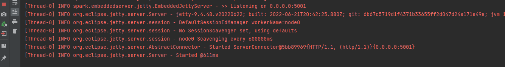

# Parcial 2 Arep

# Autor: David Arturo Narvaez Lossa

## Descripción del proyecto
Diseñe, construya y despliegue un aplicación web para identificar si una cadena es una palíndromo o no

Palíndromo Es una cadena que se lee igual si se lee de izquierda a derecha, que si se lee de derecha a izquierda.
Por ejemplo, "adbaeea" no es un palíndromo, pero en cambio, "aadbaeeabdaa" si es una palíndormo.
Otro ejemplo, "12785" no es una palíndromo, pero "127858721" si es una palíndromo.

## Software necesarias
- maven
- Java
- Git

## Correr el proyecto

Primero se clona el proyecto utilice el siguiente comando:
```
git clone https://github.com/Art2416/parcial-Arep.git
```
Una vez descargado acceda a la carpeta y corra el siguiente comando
```
mvn clean install
```
Este comando compilará las clases Java y creara una carpeta de dependencias dentro del targe.

Finalmente use el siguiente comando para verlo de forma local
```
java -cp "target/classes;target/dependency/*" escuelaing.edu.co.arep
```

## Pruebas 

Se corre el proxy (localhost:8080):


Se corre el primer servicio (Palindromo:5001):



Prueba con palindromo NO VALIDO:


Prueba con palindromo VALIDO:


Prueba con el otro servicio (Palindromo2:5002):


